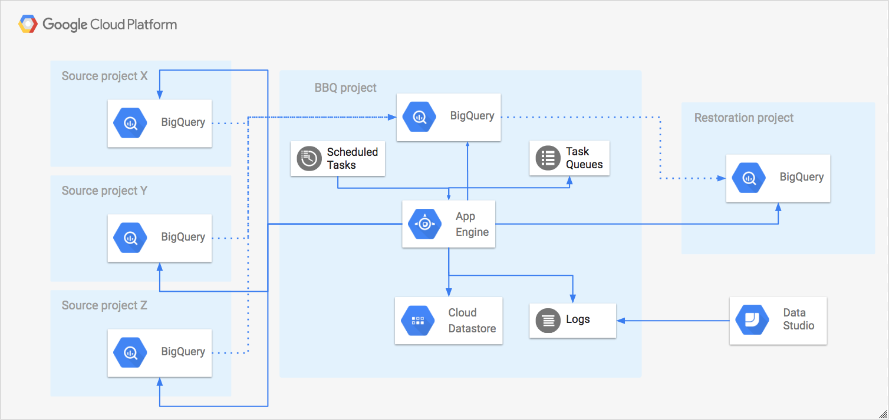

[](https://travis-ci.org/ocadotechnology/bbq)
[](https://coveralls.io/github/ocadotechnology/bbq?branch=master)

# Backup Big Query (BBQ)

BBQ (read: barbecue) is a python app that runs on Google App Engine (GAE) and creates daily backups of BigQuery tables.

# Table of contents
* [Setup](#setup)
* [Motivation](#motivation)
* [Features](#features)
* [High level architecture](#high-level-architecture)
  * [Backup process](#backup-process)
  * [Restore process](#restore-process)
  * [Retention process](#retention-process)
* [Usage](#usage)
* [Contributing](#contributing)

# Setup
To install BBQ in GCP, follow installation steps from [Setup.md](./SETUP.md) doc.

Below button opens [Setup.md](./SETUP.md) in Google Cloud Shell, where you could instantly follow described steps. 

 [](https://console.cloud.google.com/cloudshell/open?git_repo=https%3A%2F%2Fgithub.com%2Focadotechnology%2Fbbq&page=shell&tutorial=SETUP.md)


# Motivation

[Google BigQuery](https://cloud.google.com/bigquery/) is fast, highly scalable, cost-effective and fully-managed enterprise data warehouse for analytics at any scale. BigQuery automatically replicates data and keeps a 7-day history of changes.

Restoring data from existing table can be done using [snapshot decorators](https://cloud.google.com/bigquery/table-decorators#snapshot_decorators).
However when tables are deleted there are [some limitations](https://cloud.google.com/bigquery/docs/managing-tables#undeletetable): 
> It's possible to restore a table within 2 days of deletion. By leveraging snapshot decorator functionality, one may be able reference a table prior to the deletion event and then copy it. However, there are two primary caveats to creating a reference in this fashion:
> * You cannot reference a deleted table if a table bearing the same ID in the dataset was created after the deletion time.
> * You cannot reference a deleted table if the encapsulating dataset was also deleted/recreated since the table deletion event.

It is common that data streaming solutions require destination resource to be always present. If such resource (dataset or table entity) is deleted, intentionally or not, then default would be to re-create the same, but empty entity.
In such scenario we're not able to restore data using BigQuery build-in features.

### Our motivation for building BBQ was to:
* protect crucial data against application bug, user error or malicious attack,
* be able to restore to multiple versions of our data,
* restore data at scale (i.e. thousands of tables at the same time) which can be part of Disaster Recovery plan.

# Features

### Main BBQ features include:
* highly scalable daily backup of BigQuery tables (hundreds of thousands backups),
  * both single and partitioned tables are supported,
* simple, access-based whitelisting strategy. BBQ will backup tables it has access to via service account,
* retention - automatic deletion of old backups based on age and/or number of versions,
* restore - BBQ can restore:
  * whole datasets,
  * selected tables/partitions/versions.

### BBQ will not backup:
* [external data sources](https://cloud.google.com/bigquery/external-data-sources),
* Views (you can use [GCP Census](https://github.com/ocadotechnology/gcp-census) for that),
* Dataset/table labels as they are not copied by BigQuery copy job (again, you can use [GCP Census](https://github.com/ocadotechnology/gcp-census) for that)
* Empty partitioned tables without any partitions,
* Clustered partitioned table,
* Tables in [very rare use cases](NOT_SUPPORTED_USE_CASES.md).

### Known caveats
* Modification of table metadata (including table description) qualifies table to be backed up at the next cycle. It can be a problem for partitioned tables, where such change updates last modified time in every partition. Then BBQ will backup all partitions again, even though there was no actually change in partition data,
* There's 10,000 [copy jobs per project per day limit](https://cloud.google.com/bigquery/quotas#copy_jobs), which you may hit on the first day. This limit can be increased by Google Support,
* Data in table streaming buffer will be backed up on the next run, once the buffer is flushed. BBQ uses [copy-job](https://cloud.google.com/bigquery/docs/managing-tables#copy-table) for creating backups and *"Records in the streaming buffer are not considered when a copy or extract job runs"* (check [Life of a BigQuery streaming insert](https://cloud.google.com/blog/big-data/2017/06/life-of-a-bigquery-streaming-insert) for more details),
* When table name is longer than 400 characters, then in rare cases BBQ may backup tables more than once. Such backup duplicates are automatically removed by retention process. 

# High level architecture



BBQ consists of:
- multiple source projects - data of those projects will be backed up,
- BBQ project - main project where GAE runs and backups are stored,
- bbq metadata storage project - project used to separate BBQ backups that should be immutable and invisible for users without any particular reason from metadata (e.g. datastore exports, SLI)
- (optionally) default restoration project - BBQ will restore data into that project by default if provided in [config.yaml](./config/config.yaml).  

BBQ allows to perform 3 operations:
- backups - create backup tables of source tables,
- restore - copies selected backup data into restore project,
- retention - prunes backups based on selected rules.

BBQ is using Datastore as the main database to store all metadata about backups.

## Backup process


BBQ initially creates backups for all source tables, to which it has access. When source table is modified, BBQ will create a backup within 36 hours. 
Backups are created using [copy-job](https://cloud.google.com/bigquery/docs/managing-tables#copy-table) in the same [location/region](https://cloud.google.com/bigquery/docs/dataset-locations) as source data.

### Example of single table backup


BBQ can hold multiple versions of the same source table.
Every partition in partitioned table is treated as separate table (i.e. BBQ copies only modified partitions). If source table has expiration time set, the backup table will not preserve this property (so that backup never expires).

### Example of partitioned table backup


## Restore process

There are few ways in which you may restore data:
* restoring whole dataset. Most recent backups of tables in this dataset will be restored,
* restoring table by providing specific backup version. List of backups can be provided as input.

BBQ supports restoring data only into original source project or default restoration project provided in [config.yaml](./config/config.yaml). 
Both of them requires to assign BBQ Service Account appropriate IAM role that allows to manage Big Query data. 
It is also possible to set write and create disposition that specifies whether BBQ should append or replace source data.

As appending or replacing production data is super risky it is highly recommended to do it carefully, giving BBQ write access to source project should be temporary!

### Example of restoring selected partitions from partitioned table 


#### Copy job limit

There's 10,000 [copy jobs per project per day limit](https://cloud.google.com/bigquery/quotas#copy_jobs), which you may hit during the restoration. This limit can be increased by Google Support.

Note that partitions are represented as individual tables in backup storage. If you try to restore dataset with 10 tables with 500 partitions each, it will require 5000 copy jobs which is half of your daily quota.
## Retention process  

Every day retention process scans all backups to find and delete backups matching specific criteria for given source table/partition:
* if there are multiple backups per day, the most recent one is retained. Multiple backups per day are created in rare cases (e.g. when task queue task is executed more than one time),
* for backups younger than 7 months, the 10 most recent ones are retained,
* for backups older than 7 months, single most recent backup is retained,
* if source table is deleted, then the last backup is deleted after 7 months after deletion.
 
### Example of 10 versions retention for backups younger than 7 months


### Example of 7 months old backup deletion and source deletion grace period 


# Usage

## How to run backups?
Backup process is scheduled periodically for all specified projects (check [config.yaml](./config/config.yaml) to specify which projects to backup and [config/cron.yaml](./config/cron.yaml) to configure schedule time).
Note that cron uses UTC.

However, you may also invoke backup process manually from [cron jobs](https://console.cloud.google.com/appengine/taskqueues/cron).

It's worth to underline that:
* Backups for partitions are scheduled randomly within the range of time specified in [config.yaml](./config/config.yaml),
* It is possible to check the progress via [Task Queues](https://console.cloud.google.com/appengine/taskqueues).

### On-demand table backup
BBQ provides option for scheduling on-demand backup for single non-partitioned table or single partition of partitioned table. 

Note that on-demand flow will ignore checking prerequisites before scheduling copy job, as opposed to normal flow.

On-demand table backup is available from _\<your-project-id>_.__appspot.com__ site in 'Advanced' section. 

## How to find backup for given table?
### Option 1
In order to find backup __Y__ for table __X__:
1. In Cloud Console visit [Datastore](https://console.cloud.google.com/datastore),
1. Find __Key literal__ for table _X_:
    * Select __Table__ kind,
    * Filter entities equal to _X.project_id_, _X.dataset_id_, _X.table_id_ or _X.partition_id_,
    * Find table _X_ from results and copy _Key literal_,
1. Query backup _Y_:
    * Select __Backup__ kind,
    * Filter entities by _Key_ that __has ancestor__ _X.Key literal_.

To check the content for given backup __Y__ in Big Query:  
1. Open [Big Query](https://console.cloud.google.com/bigquery) in BBQ storage project,
1. Filter tables by _Y.dataset_id_ or _Y.table_id_ in search bar,
1. Select table and check _Schema_, _Details_ or _Preview_ tab.

### Option 2
It is possible to export Datastore kinds and query them in Big Query, this method is recommended for more frequent usage. 
* To enable export, check [Cloud Datastore export](./SETUP.md#cloud-datastore-export) section.
* Export is scheduled periodically; however, to have latest data you should invoke them manually from [cron jobs](https://console.cloud.google.com/appengine/taskqueues/cron).
* To find backup __Y__ for table __X__ open [Big Query](https://console.cloud.google.com/bigquery) in BBQ storage project __Z__ - replace __X__, __Y__, __Z__ in query below and execute:
    ```sql
    #StandardSQL
    WITH last_tables AS (
      SELECT *
      FROM `Y.datastore_export.Table_*`
      WHERE _TABLE_SUFFIX IN (
        SELECT MAX(_TABLE_SUFFIX) FROM `Y.datastore_export.Table_*`
      )
    ), last_backups AS (
      SELECT *, CAST(SPLIT(__key__.path, ',')[OFFSET(1)] AS INT64) AS PARENT_ID
      FROM `Y.datastore_export.Backup_*`
      WHERE _TABLE_SUFFIX IN (
        SELECT MAX(_TABLE_SUFFIX) FROM `Y.datastore_export.Backup_*`
      )
    )
    SELECT * FROM last_backups WHERE PARENT_ID IN (
      SELECT __key__.id FROM last_tables
      WHERE project_id = X.project_id AND dataset_id = X.dataset_id AND table_id = X.table_id
    ) 
    ```
## How to restore data from backups?
There are several options to restore data, available from _\<your-project-id>_.__appspot.com__
* __Restore whole dataset__ 
* __Restore single table__ 
* __Restore tables from custom list of backups__

#### Checking status of restoration process
 Restore process is asynchronous. To check status of process, follow links returned in response:
  
 * **restorationWarningsOnlyStatusEndpoint** - it shows general progress only and only failed copy jobs (if any)
 
 * **restorationStatusEndpoint** - it shows all information about progress and each copy job.
 
 We advise to use *restorationWarningsOnlyStatusEndpoint* for bigger datasets as the response time is quicker and response size smaller.

# Community

Subscribe or post to [backup-big-query@googlegroups.com](https://groups.google.com/forum/#!forum/backup-big-query) to follow along and ask questions about the BBQ.
 
# Contributing

Feel free to submit feature requests and bug reports under Issues.

If you would like to contribute to our development efforts, please review our [contributing guidelines](/CONTRIBUTING.md) and submit a pull request.
 