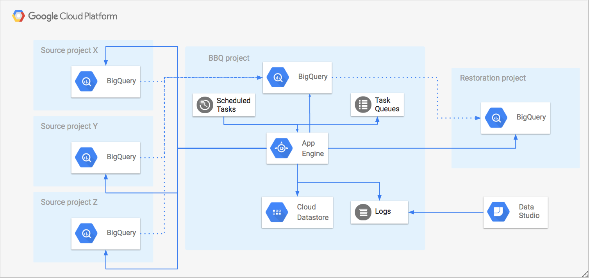

[](https://travis-ci.org/ocadotechnology/bbq)
[](https://coveralls.io/github/ocadotechnology/bbq?branch=master)

# Backup Big Query (BBQ)

BBQ (read: barbecue) is a GAE python based app which creates daily backups of BigQuery modified tables.

# Motivation

[Google BigQuery](https://cloud.google.com/bigquery/) is fast, highly scalable, cost-effective and a fully-managed enterprise data warehouse for analytics at any scale. BigQuery automatically replicates data and keeps a 7-day history of changes.

Restoring data from existing table can be done using [snapshot decorators](https://cloud.google.com/bigquery/table-decorators#snapshot_decorators).
However when tables are deleted there are [some limitations](https://cloud.google.com/bigquery/docs/managing-tables#undeletetable): 
> It's possible to restore a table within 2 days of deletion. By leveraging snapshot decorator functionality, one may be able reference a table prior to the deletion event and then copy it. However, there are two primary caveats to creating a reference in this fashion:
> * You cannot reference a deleted table if a table bearing the same ID in the dataset was created after the deletion time.
> * You cannot reference a deleted table if the encapsulating dataset was also deleted/recreated since the table deletion event.

Some of our apps dynamically create datasets and tables if they are missing. If some table/dataset is deleted (unintentionally), then empty table can be automatically recreated.
In such scenario we're not able to restore data using BigQuery build-in features.

#### Our motivation for building BBQ was to:
* protect crucial data against application bug, user error or malicious attack,
* store multiple versions of our data for several months, not days,
* easily restore multiple (i.e. thousands) tables at the same time.

# Features

#### Main BBQ features include:
* daily backup of single or partitioned tables:
  * only modified data is backed up using [copy-job](https://cloud.google.com/bigquery/docs/managing-tables#copy-table),
  * multiple backup versions are supported,
  * every partition is treated as a separate table (i.e. BBQ copies only modified partitions),
  * if source table has expiration time set, it's cleared from the backup,
  * can manage hundreds of thousands backups.
* retention - automatic deletion of old backups based on age and/or number of versions,
* restore - BBQ can restore:
  * whole datasets,
  * selected tables/partitions/versions.

#### BBQ doesn't support backing up:
* [external data sources](https://cloud.google.com/bigquery/external-data-sources),
* Views (you can use [GCP Census](https://github.com/ocadotechnology/gcp-census) for that),
* Dataset/table labels as they are not copied by BigQuery copy job (again, you can use [GCP Census](https://github.com/ocadotechnology/gcp-census) for that)  

#### Caveats
* Modifying partitioned table description triggers backing up all partitions as last modified time is updated for every partition
* There's 10,000 [copy jobs per project per day limit](https://cloud.google.com/bigquery/quotas#copy_jobs), which you may hit on the first day. This limit can be increased by Google Support

# High level architecture



BBQ consists of:
- multiple source projects - BBQ backups data from them,
- BBQ project - main project where GAE runs and backups are stored,
- Restoration project - destination project, where data is restored.

BBQ have 3 distinct processes:
- backups - create backup tables of source tables,
- retention - prunes backups based on selected rules,
- restore - copies selected backup data into restore project. 

Here's how backup process works, step by step:
- App Engine cron triggers a daily run,
- BBQ crawls Big Query tables from all projects/datasets to which it has access,
- It creates a "table check" task for each table and schedules it for execution in App Engine Task Queue,
- "table check" task retrieves table metadata. In case of partitioned table, this tasks splits and reschedules into multiple "table check" tasks, one for every partition. After retrieving metadata, "table check" task checks backup state of table/partition in Datastore. If ```lastModifiedTime``` from Datastore is older than ```lastModifiedTime``` of source table, then "backup' task is scheduled,
- "backup" task inserts a copy job to copy table from source project to BBQ project. When this job successfully completes, backup table metadata are stored in Datastore.  